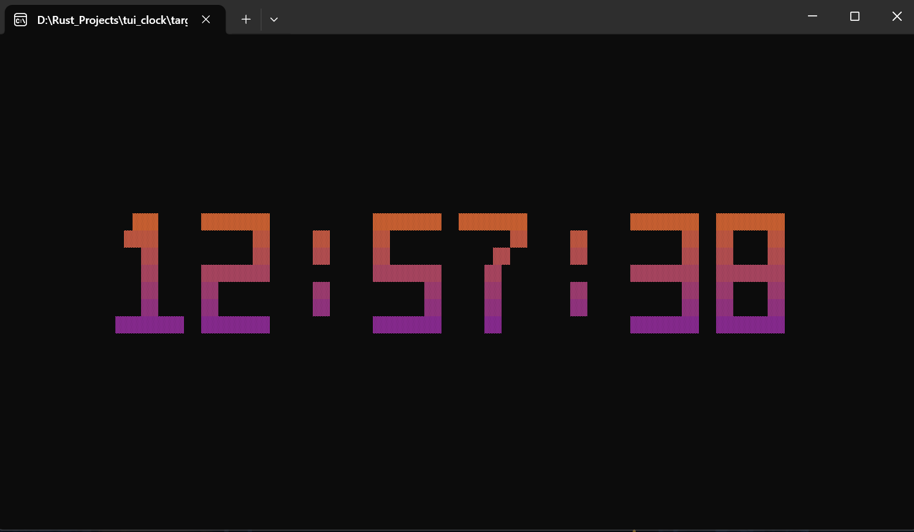

# tui_clock


A terminal clock written from scratch with [crossterm](https://github.com/crossterm-rs/crossterm) —
no ratatui, no TUI framework. Every digit is hand-drawn from `#` patterns in code
and rendered cell by cell.



## Features

大字号点阵时钟，字形是手写的 7 行字符串数组
12 / 24 小时制（12 小时制自动带 AM/PM）
秒显示开关
三套渐变配色（Classic / Sunset / Ocean），纵向线性插值，未来会加入更多
配置持久化，首次运行自动生成配置文件
无闪烁、无光标残留

## Run

```bash
cargo run --release
```

## Keys


| `Esc`   | 时钟页打开菜单；其他页面返回上一级 
| `↑` `↓` | 菜单 / 设置页移动光标 
| `←` `→` | 切换当前设置项的值 
| `Enter` | 进入选中的菜单项 
| `q` / `Ctrl+C` | 退出 

## Configuration

首次运行时自动生成：
|Windows | `%APPDATA%\tui_clock\config.toml` 
|Linux   | `~/.config/tui_clock/config.toml` 
|macOS   | `~/Library/Application Support/tui_clock/config.toml` 

```toml
hour_format  = "24H"      # 24H | 12H
show_seconds = true       # true | false
theme        = "Classic"  # Classic | Sunset | Ocean
```

在设置页改动后，退出时会写回文件。

## Structure

| File | Responsibility |
| --- | --- |
|main.rs  | 生命周期：终端初始化、事件循环、配置读写 
|app.rs   | 状态机：`Screen` 与 `Settings` 
|ui.rs    | 绘制：只管排版，不含业务知识 
|theme.rs | 配色与渐变插值 
|font.rs  | 字形数据 
|config.rs| 配置文件的路径 / 解析 / 序列化 

## License

MIT


版本更新记录：
2026-09-06 V0.1.0
使时钟能够读取真实时间并显示出来
在每次时间刷新后清屏
加入进入备用屏幕的功能，保证清屏后内容不会留在终端中
加入时钟居中的功能

2026-09-07 V0.2.0
修改时钟字体，使之显示为更自然的方块字
加入快捷键退出功能

2026-09-09 V0.3.0
修改字体间距，使之观感更加自然
将时钟宽高计算统一为usize
加入终端宽高不足以显示时间时显示提示语的功能
把【清屏 + 所有行】合并成一个批次发出，解决刷新时闪烁的问题

2026-09-10 V0.4.0
在进入备用屏幕时隐藏了光标
拆开功能实现为app.rs,font.rs.ui.rs,main.rs
app.rs（状态机）/ ui.rs（绘制）/ main.rs（生命周期）职责分离

2026-09-12 V0.5.0
修复了menu中选项文字不齐的问题
在menu中空间不足时渲染提示语
加入调整小时制的功能
加入About

2026-09-13 V0.6.0
加入时间秒钟自定义开关的功能

2026-09-15 V0.7.0
加入主题功能，分别为
    Ocean
    Sunset
    Classic
设置了4096的缓冲区，避免刷新时画面异常闪烁

2026-09-16 V1.0.0
加入用配置文件调整settings的功能
完善about页面


